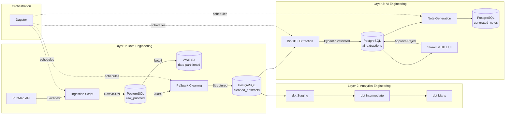

# OncoExtract: Clinical Abstraction Pipeline

## The Problem

In oncology drug development, clinical teams must manually review thousands of medical research papers to extract key data points -- cancer stage, treatment type, biomarkers tested, patient count. A single reviewer typically spends **8-10 minutes per abstract**, and with thousands of new publications each year, this manual process becomes a major bottleneck that slows down drug development timelines.

## The Solution

OncoExtract automates clinical variable extraction from oncology literature. The pipeline ingests ~5,000 nasopharyngeal carcinoma (NPC) abstracts from PubMed, uses AI to extract structured variables (TNM stage, treatment modality, biomarkers, sample size), and presents the results in a human-in-the-loop (HITL) review interface where a clinician can approve or correct each extraction in seconds instead of minutes -- reducing manual review workload by an estimated **95%**.

## Architecture



## Tech Stack

| Component | Tool | Purpose |
|:---|:---|:---|
| Ingestion | Python + requests | PubMed E-utilities API client |
| Processing | PySpark (Docker) | Text cleaning and normalization |
| Storage | PostgreSQL 16 | Raw, cleaned, and extracted data |
| Orchestration | Dagster | Pipeline scheduling and monitoring |
| Analytics | dbt | Staging, intermediate, and mart models |
| AI Extraction | BioGPT (HuggingFace) | Clinical variable extraction |
| Validation | Pydantic + custom metrics | Precision/recall/F1 per field |
| HITL Review | Streamlit | Human review and correction interface |
| Cloud Storage | AWS S3 | Raw data archival with date-partitioned keys |
| Infrastructure | Docker Compose | Multi-container orchestration (Postgres + Spark) |

## Production deployment (scaling)

This repo runs **locally** for development: Spark in Docker (`local[*]`), Postgres on `localhost`, and S3 via boto3 to a real AWS bucket.

In production, the same components map cleanly to managed services:

| Local / dev | Typical production choice |
|:---|:---|
| Docker Spark (`apache/spark`) | **Amazon EMR**, **Databricks**, or **GCP Dataproc** running the same PySpark JAR/notebook; JDBC URLs point at RDS/BigQuery instead of local Postgres |
| PostgreSQL in Docker | **Amazon RDS for PostgreSQL**, **Cloud SQL**, or **Azure Database for PostgreSQL** |
| Raw archive to S3 | Same pattern: partition keys `raw/pubmed/YYYY-MM-DD/{pmid}.json`; lifecycle rules for cost |
| Dagster | **Dagster Cloud** or self-hosted on Kubernetes with per-asset run queues and retries |
| Streamlit | **Streamlit Community Cloud**, container behind a load balancer, or internal VPN |

The PySpark job does not depend on Hadoop on the laptop: it reads/writes **Postgres over JDBC**. Packaging that job as a **spark-submit** step on EMR or a **Databricks job** is the standard scale-up path; only cluster config and JDBC secrets change.

## HITL evaluation

The first model output is stored in `original_extracted_json`; after a reviewer approves (with or without edits), `extracted_json` holds the human-reviewed truth. The Streamlit **Evaluation** tab shows **field-level agreement rates** (AI vs human) for verified rows. Run `scripts/migrate_001_original_extracted_json.sql` once if your database was created before that column existed.

## Quick Start

### Prerequisites

- Python 3.10+
- Docker (for PostgreSQL + Spark -- no local Java required)
- [uv](https://docs.astral.sh/uv/) package manager

### Setup

```bash
# Clone the repo
git clone https://github.com/your-username/oncoextract.git
cd oncoextract

# Start PostgreSQL + Spark (multi-container stack)
docker compose up -d

# Install dependencies
uv sync --all-extras

# Run all tests
uv run pytest
```

### Run the Pipeline

```bash
# Option 1: Run via Dagster UI
uv run dagster dev -m oncoextract.dagster_defs

# Option 2: Run individual steps
uv run python -m oncoextract.ingest.pubmed     # Ingest from PubMed
docker compose exec spark bash /app/spark-entrypoint.sh  # Clean with PySpark (in Docker)
uv run python -m oncoextract.ai.extract         # AI extraction
uv run python -m oncoextract.ai.summarize       # Generate notes
```

### Run dbt Models

```bash
cd dbt_oncoextract
uv run dbt build --profiles-dir . --project-dir .
uv run dbt docs generate --profiles-dir . --project-dir .
uv run dbt docs serve --profiles-dir . --project-dir .
```

### Launch HITL Review UI

```bash
uv run streamlit run streamlit_app/app.py
```

Open **Review Queue** to approve or edit extractions; open **Evaluation** to see AI-vs-human agreement by field after reviews.

## Project Structure

```
oncoextract/
├── pyproject.toml              # Dependencies and project config
├── docker-compose.yml          # PostgreSQL + Spark containers
├── init.sql                    # Database schema with indexes
├── dagster.yaml                # Dagster configuration
│
├── oncoextract/
│   ├── ingest/pubmed.py        # PubMed API client with rate limiting
│   ├── spark/clean.py          # PySpark text cleaning job
│   ├── ai/extract.py           # BioGPT clinical extraction + rule-based fallback
│   ├── ai/summarize.py         # Clinical note generation + validation metrics
│   ├── dagster_defs/           # Dagster assets, jobs, definitions
│   └── db/models.py            # Database connection helpers
│
├── dbt_oncoextract/
│   ├── models/staging/         # stg_pubmed_abstracts
│   ├── models/intermediate/    # int_abstracts_parsed (biomarker/treatment flags)
│   └── models/marts/           # mart_cancer_studies, mart_treatment_outcomes
│
├── streamlit_app/app.py        # HITL review interface
│
└── tests/                      # 32 unit tests
    ├── test_ingest.py           # XML parsing tests
    ├── test_spark.py            # Text normalization tests
    ├── test_extract.py          # Extraction logic tests
    └── test_summarize.py        # Summarization + metrics tests
```

## Database Schema

| Table | Purpose |
|:---|:---|
| `raw_pubmed` | Raw JSON from PubMed API |
| `cleaned_abstracts` | Normalized text with GIN index on MeSH terms |
| `ai_extractions` | Structured clinical variables + confidence scores; `original_extracted_json` = first AI output for evaluation |
| `generated_notes` | AI-generated clinical summaries |
| `validation_runs` | Precision/recall/F1 metrics over time |

## Configuration

Copy `.env.example` to `.env` and fill in your PubMed API key:

```bash
cp .env.example .env
```

### PySpark via Docker

PySpark runs inside an `apache/spark:3.5.6-python3` container -- no local
Java or Hadoop installation required. The Spark master UI is available at
`http://localhost:8080` when the stack is running.

```bash
# Start the full stack
docker compose up -d

# Run the Spark cleaning job
docker compose exec spark bash /app/spark-entrypoint.sh
```

When triggered via Dagster, the Spark job is automatically submitted to
the Docker container.

## License

MIT
